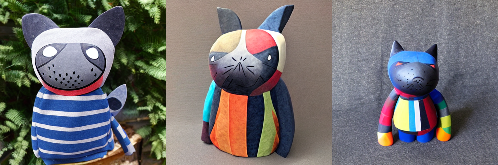
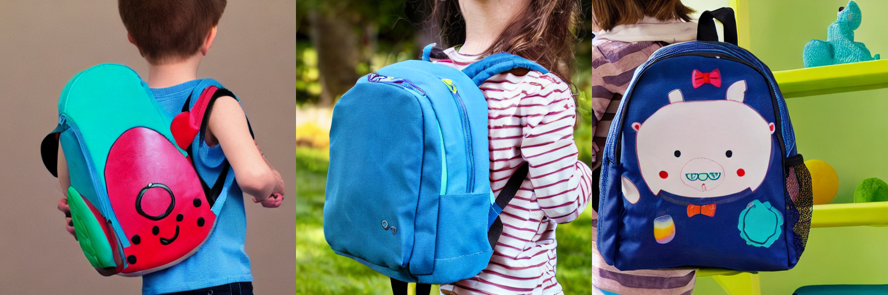

# prompt-plus-pytorch
<a href="https://colab.research.google.com/gist/mkshing/a4a7745572690427a83e942248126b3c/sd_prompt_plus_training.ipynb" target="_parent"></a>

An implementation of [P+: Extended Textual Conditioning in Text-to-Image Generation](https://prompt-plus.github.io/) by using d🧨ffusers. 

My summary is found [here](https://twitter.com/mk1stats/status/1637785231729262592).


## Current Status
I can't still get better results than Textual Inversion. 
The hyper-parameters are exactly same as Textual Inversion except the number of training steps as the paper said in section 4.2.2.

**Textual inversion:**

**Extended Textual Inversion:**


Does it mean that we need n-layer x training steps (500) in total? My current implementation is jointly training all embeddings. 
> This optimization is applied independently to each cross-attention layer.

## Installation
```commandline
git clone https://github.com/mkshing/prompt-plus-pytorch
pip install -r requirements.txt
```

## Training
```commandline
accelerate launch train_p_plus.py \
  --pretrained_model_name_or_path="CompVis/stable-diffusion-v1-4" \
  --train_data_dir="assets/cat_statue" \
  --learnable_property="object" \
  --placeholder_token="<cat-toy>" --initializer_token="toy" \
  --resolution=512 \
  --train_batch_size=1 \
  --gradient_accumulation_steps=8 \
  --max_train_steps=500 \
  --learning_rate=5.0e-03 \
  --lr_scheduler="constant" \
  --lr_warmup_steps=0 \
  --output_dir="xti_cat" \
  --report_to "wandb" \
  --only_save_embeds \
  --enable_xformers_memory_efficient_attention
```

## Inference

```python
from prompt_plus import PPlusStableDiffusionPipeline

pipe = PPlusStableDiffusionPipeline.from_learned_embed(
    pretrained_model_name_or_path="CompVis/stable-diffusion-v1-4",
    learned_embed_name_or_path="learned-embed.bin path"
)
prompt = "A <cat-toy> backpack"
image = pipe(prompt, num_inference_steps=50, guidance_scale=7.5).images[0]
image.save("cat-backpack.png")
```
They also proposed "Style Mixing" to combine 2 embeds. 
```python
pipe = PPlusStableDiffusionPipeline.from_learned_embed(
    pretrained_model_name_or_path="CompVis/stable-diffusion-v1-4",
    learned_embed_name_or_path=["learned-embed 1", "learned-embed 2"],
    style_mixing_k_K=(5, 10),
)
```
Also, I made a pipeline for textual inversion to test easily. 
```python
from prompt_plus import TextualInversionStableDiffusionPipeline

pipe = TextualInversionStableDiffusionPipeline.from_learned_embed(
    pretrained_model_name_or_path="CompVis/stable-diffusion-v1-4",
    learned_embed_name_or_path="sd-concepts-library/cat-toy",
)
prompt = "A <cat-toy> backpack"
images = pipe(prompt, num_inference_steps=50, guidance_scale=7.5)
```

If you want to do inference in commandline, 
```commandline
python inference.py \
  --pretrained_model_name_or_path "CompVis/stable-diffusion-v1-4" \
  --learned_embed_name_or_path "xti_cat" \
  --prompt "A <cat-toy> backpack" \
  --float16 \
  --seed 1000
```
## Citation

```bibtex
@article{voynov2023P+,
  title={P+: Extended Textual Conditioning in Text-to-Image Generation},
  author={Voynov, Andrey and Chu, Qinghao and Cohen-Or, Daniel and Aberman, Kfir},
  booktitle={arXiv preprint},
  year={2023},
  url={https://arxiv.org/abs/2303.09522}
} 
```

## Reference
- [diffusers Textual Inversion code](https://github.com/huggingface/diffusers/tree/main/examples/textual_inversion)

## TODO
- [x] Training
- [x] Inference
- [x] Style Mixing
- [ ] Regularization 